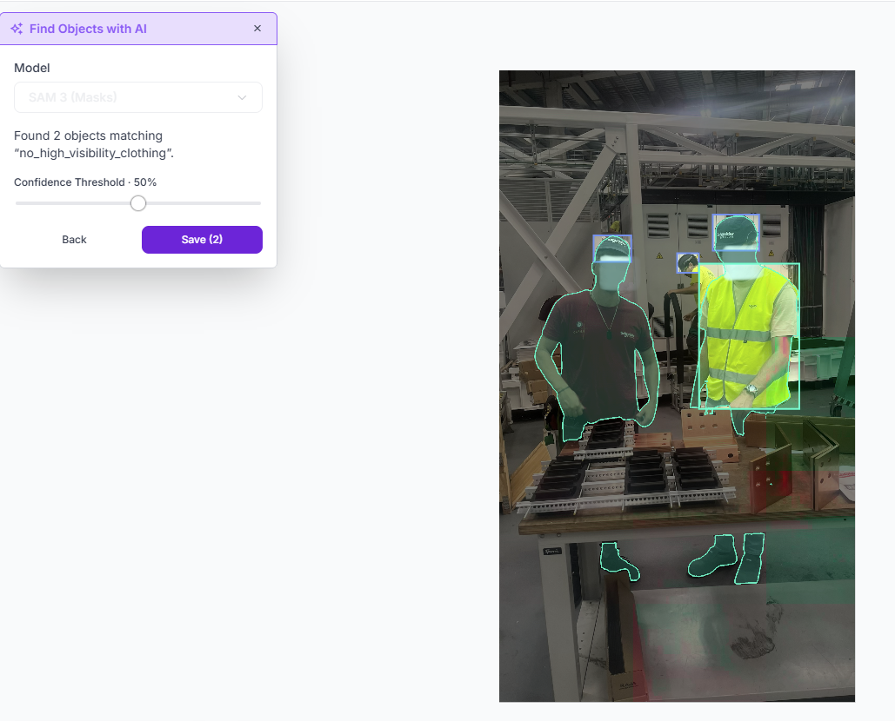

# SAM Exploration Notes

## What was tested

**Tool:** Roboflow editor → *Find Objects with AI* → model **SAM 3 (Masks)**. This is the no-code SAM 3 workflow shown in Session 2.

**When:** 25 Sep 2026, while preparing the iteration-2 labels ([`iteration2.md`](iteration2.md)).

**Test image:** `IMG_3414`. It shows a worker in a red company T-shirt (with a cap, but **no** vest) next to a worker wearing a cap and a closed yellow vest.

**Prompt:**
- Class: `no_high_visibility_clothing`
- Description: *"upper body of a worker wearing a red t-shirt, without a reflective safety vest"*
- Confidence threshold: 50 %

## What helped

- **Mask quality was excellent.** SAM 3 traced the red-shirt worker's upper body precisely, including the arms, from a text prompt alone, with no clicks.
- **Zero-shot:** no training or example boxes were needed, so it could speed up labelling for classes that can be described by what is *visible* (e.g. "red t-shirt", "yellow vest").

## What failed

1. **It cannot express absence.** It also selected the worker who **was** wearing a vest. The prompt "without a reflective safety vest" was effectively read as "worker / upper body". A violation class defined by a *missing* object is exactly the kind of concept that a segmentation prompt handles badly.
2. **Fragmented masks and the "geometry tax".** Both workers' **shoes** were returned as separate mask fragments. When a mask is converted to a detection box (min/max of all points), those fragments would stretch the torso box down to the feet. This breaks the head/torso box rule.
3. **Project rules are invisible to it.** SAM 3 cannot know the project rule that an *open* vest is not valid PPE.

## Decision

SAM 3 suggestions were **not saved**. The new iteration-2 boxes were drawn manually. The iteration-1 labels had been created with Roboflow **Astra Auto Label** (not SAM), then fully reviewed by hand.

**Take-away:** foundation models are useful for **"find this visible thing"**. For **rule-based or absence-based classes** (compliance), human labelling with a written class contract is still necessary.
